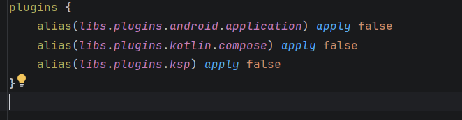
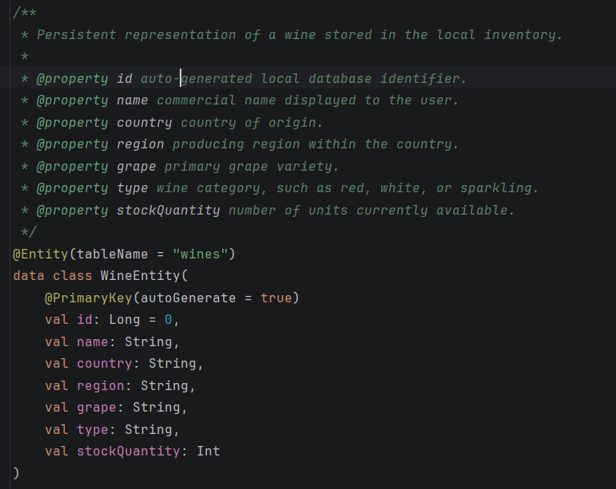
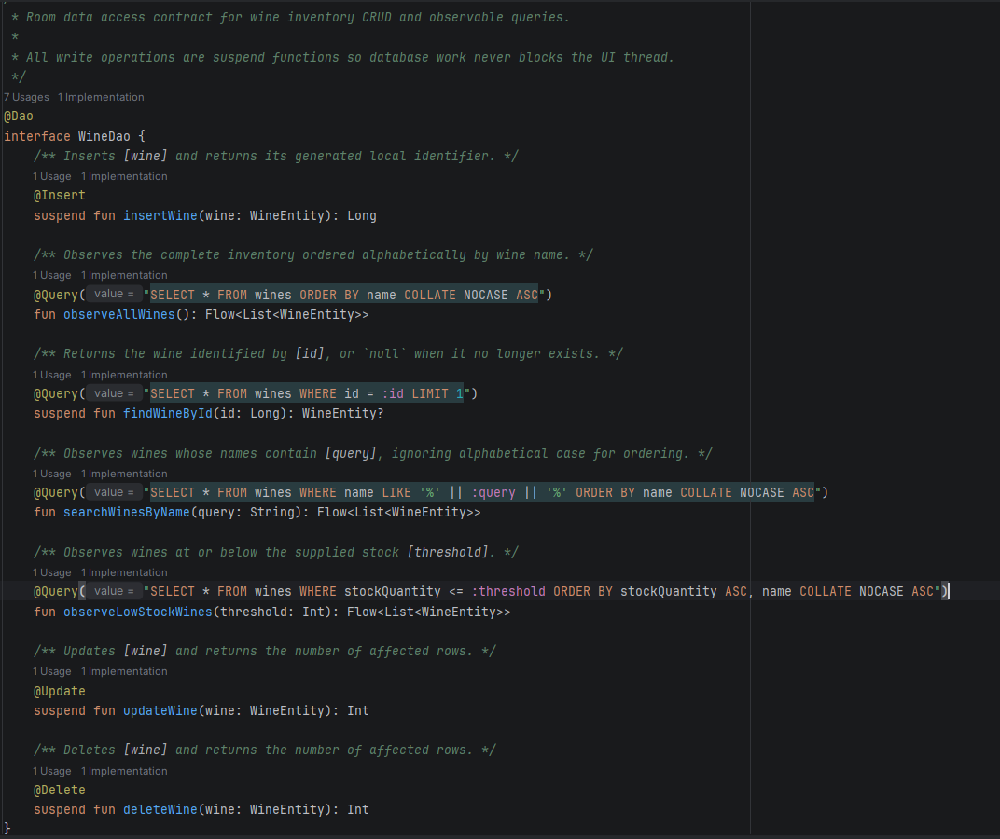
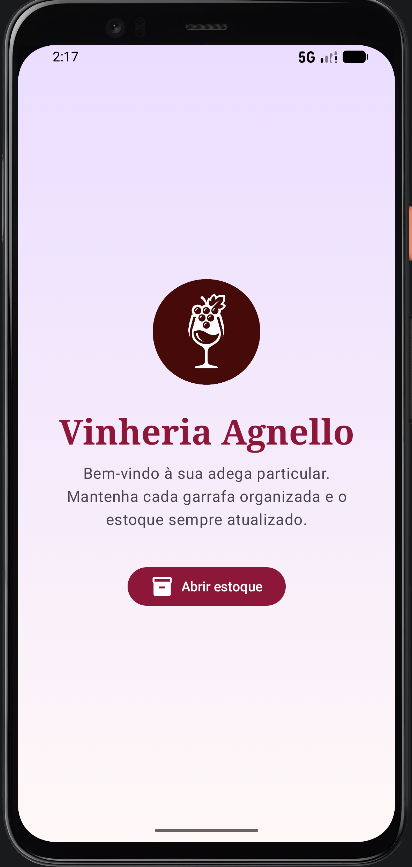
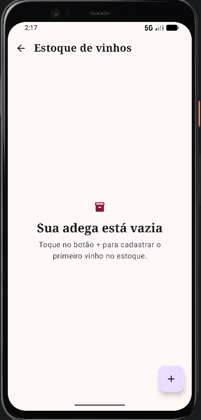
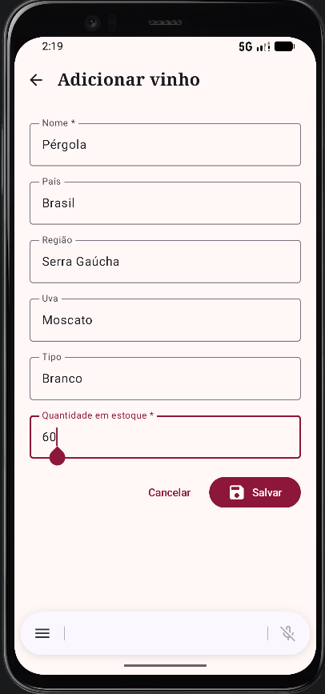
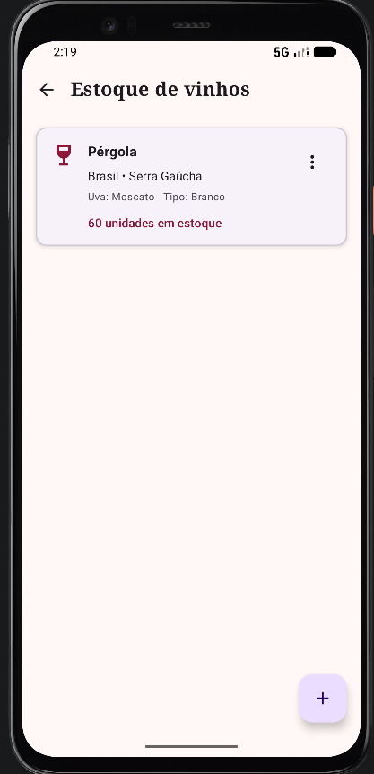
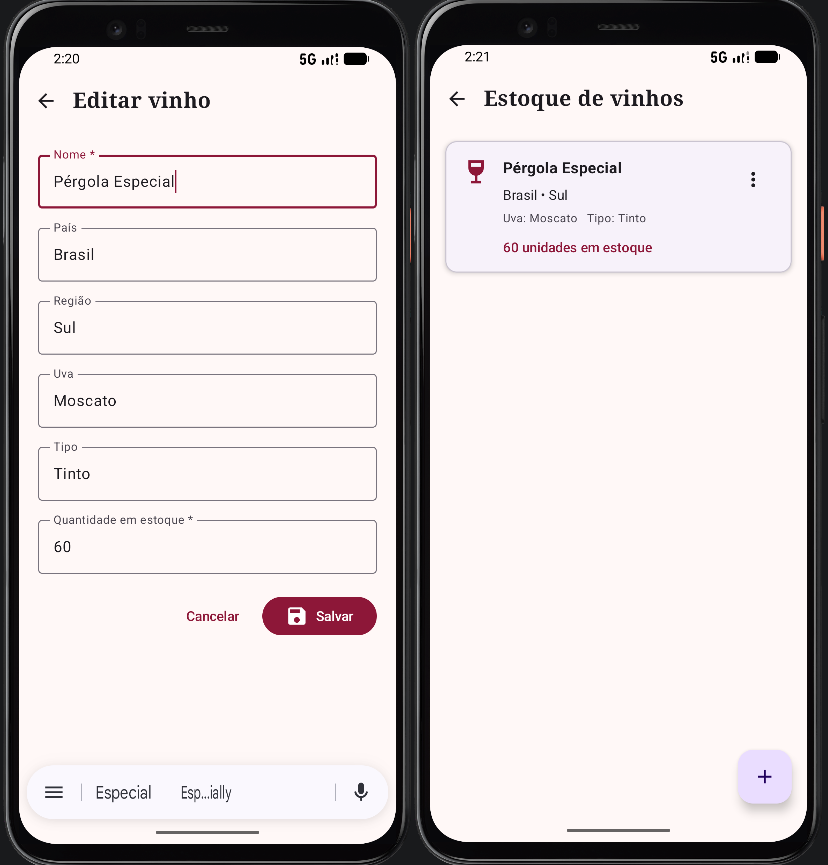
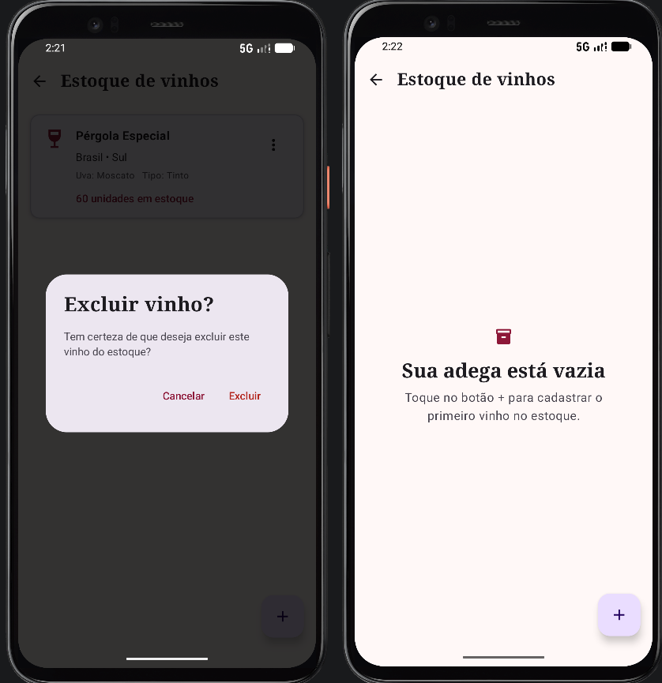

# Vinheria Agnello — Persistência Local de Estoque

Aplicativo Android desenvolvido para cadastrar e gerenciar o estoque de vinhos da Vinheria Agnello. A solução utiliza **Kotlin**, **Jetpack Compose** e **Room**, mantendo os dados em um banco SQLite local no dispositivo.

O projeto foi construído como aplicação prática do Capítulo 7 — Persistência de Dados Locais. O fluxo completo parte das telas Compose, passa pelo ViewModel e pelo Repository e chega ao DAO responsável pelas operações no Room.

## Escopo da solução

No domínio deste projeto, o produto de estoque é representado por `WineEntity`. A entidade é especializada em vinhos porque esse é o produto principal da Vinheria Agnello, mas ocupa o mesmo papel da entidade Produto solicitada na atividade.

Cada registro armazena:

- `id`: identificador local autogerado;
- `name`: nome comercial do vinho;
- `country`: país de origem;
- `region`: região produtora;
- `grape`: variedade da uva;
- `type`: tipo do vinho;
- `stockQuantity`: quantidade disponível no estoque.

A entidade gera a tabela `wines`. O schema exportado pelo Room pode ser consultado em [`app/schemas`](app/schemas).

## Configuração do Room

O módulo `app` está configurado com:

- `androidx.room:room-runtime` para execução do banco;
- `androidx.room:room-ktx` para integração com coroutines e `Flow`;
- `androidx.room:room-compiler` processado pelo KSP;
- plugin `com.google.devtools.ksp` para geração das implementações do banco e do DAO;
- diretório de exportação dos schemas para acompanhamento das versões.

As versões ficam centralizadas no catálogo [`gradle/libs.versions.toml`](gradle/libs.versions.toml), enquanto plugins, dependências e configuração do KSP estão em [`app/build.gradle.kts`](app/build.gradle.kts).

Durante a compilação, o Room analisa `@Entity`, `@Dao`, `@Query` e `@Database`. O KSP gera classes como `WineDao_Impl` e `VinheriaDatabase_Impl`, evitando implementações SQLite manuais e validando as consultas em tempo de compilação.

## Persistência local

[`VinheriaDatabase`](app/src/main/java/br/com/fiap/vinheriaagnello/data/local/VinheriaDatabase.kt) é um `RoomDatabase` Singleton, utiliza o arquivo `vinheria_stock.db` e expõe uma única instância de `WineDao` para o processo da aplicação.

As consultas observáveis retornam `Flow<List<WineEntity>>`. Quando a tabela muda, a lista Compose recebe o novo estado automaticamente. Inserções, atualizações, exclusões e consultas pontuais utilizam funções `suspend`, mantendo o acesso ao banco fora da thread principal.

## Operações CRUD

| Operação | Caminho implementado | Comportamento no aplicativo |
|---|---|---|
| **Create** | `WineFormScreen → StockViewModel → WineRepository → insertWine()` | Valida o formulário, gera o ID e adiciona o vinho à lista. |
| **Read** | `observeAllWines() → Flow → StockUiState → StockScreen` | Exibe o estoque em ordem alfabética e reage às alterações da tabela. |
| **Update** | `stock/edit/{wineId} → updateWine()` | Carrega o produto pelo ID, salva as alterações e atualiza a lista. |
| **Delete** | Confirmação na tela → `deleteWine()` | Exige confirmação e remove o registro persistido. |

O DAO também oferece consultas por nome e por limite de estoque, deixando a camada local preparada para filtros futuros.

## Regras e tratamento de estado

- o nome do vinho é obrigatório;
- a quantidade deve ser um número inteiro não negativo;
- update e delete verificam se exatamente uma linha foi alterada;
- exclusões exigem confirmação;

## Organização das responsabilidades

- **Screen:** renderiza estado e encaminha ações do usuário.
- **ViewModel:** mantém o estado da UI, valida formulários e inicia operações assíncronas.
- **Repository:** concentra regras de dados e impede acesso direto da UI ao DAO.
- **DAO:** declara consultas e operações CRUD verificadas pelo Room.
- **Room/SQLite:** persiste os registros no armazenamento local do dispositivo.

[`VinheriaApplication`](app/src/main/java/br/com/fiap/vinheriaagnello/VinheriaApplication.kt) mantém um pequeno container de injeção manual. Ele fornece o Repository construído a partir do banco Singleton.

## Navegação e interface

O aplicativo possui quatro rotas:

```text
home
└── stock
    ├── stock/new
    └── stock/edit/{wineId}
```

A tela inicial abre o módulo de estoque. A listagem apresenta nome, origem, uva, tipo e quantidade, além de um menu para editar ou excluir. O mesmo formulário atende criação e edição, diferenciadas pela presença do `wineId`.

## Arquivos relevantes

| Responsabilidade | Arquivo |
|---|---|
| Configuração de dependências | [`app/build.gradle.kts`](app/build.gradle.kts) |
| Catálogo de versões | [`gradle/libs.versions.toml`](gradle/libs.versions.toml) |
| Entidade/tabela de vinhos | [`WineEntity.kt`](app/src/main/java/br/com/fiap/vinheriaagnello/data/local/WineEntity.kt) |
| Contrato CRUD e consultas SQL | [`WineDao.kt`](app/src/main/java/br/com/fiap/vinheriaagnello/data/local/WineDao.kt) |
| Banco Singleton | [`VinheriaDatabase.kt`](app/src/main/java/br/com/fiap/vinheriaagnello/data/local/VinheriaDatabase.kt) |
| Regras da camada de dados | [`WineRepository.kt`](app/src/main/java/br/com/fiap/vinheriaagnello/data/repository/WineRepository.kt) |
| Estado e ações da interface | [`StockViewModel.kt`](app/src/main/java/br/com/fiap/vinheriaagnello/ui/stock/StockViewModel.kt) |
| Listagem do estoque | [`StockScreen.kt`](app/src/main/java/br/com/fiap/vinheriaagnello/ui/stock/StockScreen.kt) |
| Card de produto | [`WineListItem.kt`](app/src/main/java/br/com/fiap/vinheriaagnello/ui/stock/WineListItem.kt) |
| Cadastro e edição | [`WineFormScreen.kt`](app/src/main/java/br/com/fiap/vinheriaagnello/ui/stock/WineFormScreen.kt) |
| Rotas da aplicação | [`AppNavigation.kt`](app/src/main/java/br/com/fiap/vinheriaagnello/ui/navigation/AppNavigation.kt) |
| Textos pt-BR | [`strings.xml`](app/src/main/res/values/strings.xml) |

## Execução e verificação

Requisitos do ambiente atual:

- Android Studio com suporte ao AGP utilizado pelo projeto;
- JDK 21 para o Gradle;
- Android SDK 36.1;
- dispositivo ou emulador a partir da API 26.

Para gerar o APK de debug:

```powershell
.\gradlew.bat :app:assembleDebug
```

Para executar a análise estática:

```powershell
.\gradlew.bat :app:lintDebug
```

O APK é gerado em `app/build/outputs/apk/debug/app-debug.apk`.

## Evidências da implementação

As capturas abaixo estão armazenadas em [`docs/`](docs/) e relacionam a configuração e o código às operações executadas no aplicativo.

### 1. Configuração do Room e KSP

Plugins e dependências utilizados para integrar o Room ao módulo Android.

<p align="center">
  
</p>

### 2. Entidade de produto

`WineEntity` representa o produto persistido e define os campos da tabela `wines`.

<p align="center">
  
</p>

### 3. DAO e banco de dados

Métodos CRUD declarados no `WineDao` e configuração do banco Singleton em `VinheriaDatabase`.

<p align="center">
  
</p>

### 4. Tela inicial

Identidade visual da Vinheria Agnello e acesso ao módulo de estoque.

<p align="center">
  
</p>

### 5. Estado de estoque vazio

Comportamento apresentado quando ainda não existem produtos cadastrados.

<p align="center">
  
</p>

### 6. Cadastro de vinho

Formulário compartilhado pelo fluxo de criação e atualização de produtos.

<p align="center">
  
</p>

### 7. Leitura do estoque

Produto exibido na lista reativa após ser persistido no banco local.

<p align="center">
  
</p>

### 8. Atualização de produto

Comparação do registro antes e depois da edição persistida pelo Room.

<p align="center">
  
</p>

### 9. Exclusão de produto

Confirmação de exclusão e resultado da remoção do registro da lista.

<p align="center">
  
</p>

## Estrutura e árvore de arquitetura

```text
br.com.fiap.vinheriaagnello
├── MainActivity.kt                         # Host da interface Compose
├── VinheriaApplication.kt                  # Contêiner manual de dependências
├── data
│   ├── local                               # DAO → Room → SQLite
│   │   ├── WineEntity.kt                   # Tabela de produtos do estoque
│   │   ├── WineDao.kt                      # CRUD e consultas observáveis
│   │   └── VinheriaDatabase.kt             # Banco Room Singleton
│   └── repository
│       └── WineRepository.kt               # Regras de dados e abstração do DAO
└── ui                                      # Tela → ViewModel
    ├── home
    │   └── MainScreen.kt                   # Tela inicial do aplicativo
    ├── navigation
    │   └── AppNavigation.kt                # Rotas de início, estoque, cadastro e edição
    ├── stock
    │   ├── StockScreen.kt                  # Lista reativa do estoque
    │   ├── WineListItem.kt                 # Card do produto e suas ações
    │   ├── WineFormScreen.kt               # Formulário de cadastro e edição
    │   ├── StockUiState.kt                 # Estado imutável da interface e eventos
    │   └── StockViewModel.kt               # Validação e ações de negócio
    └── theme
        ├── Color.kt
        ├── Theme.kt
        └── Type.kt
```
